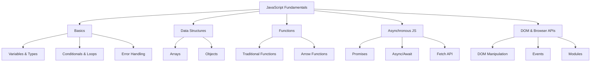
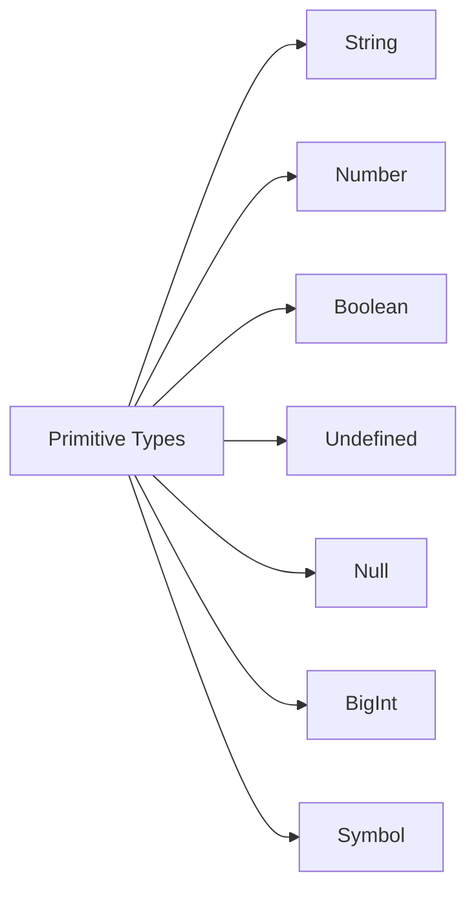
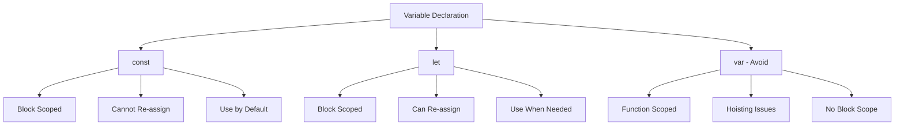
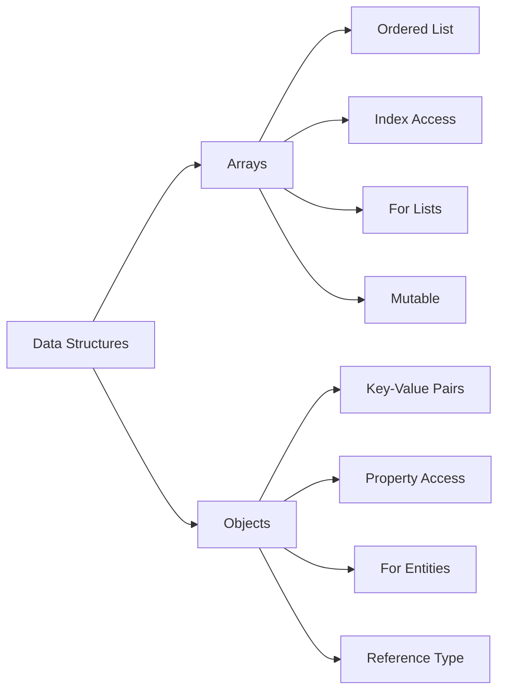
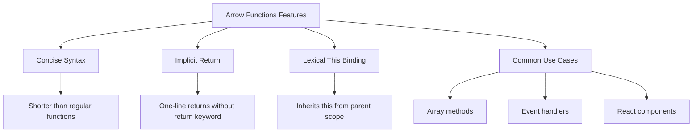
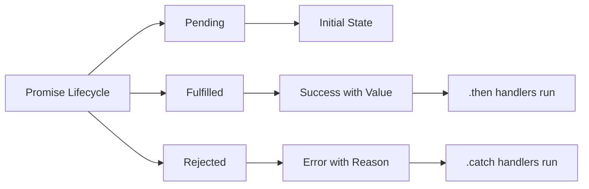
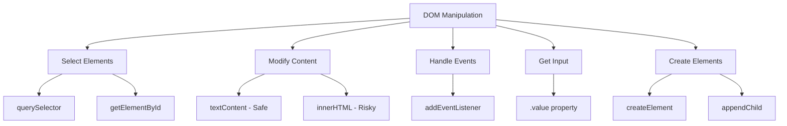
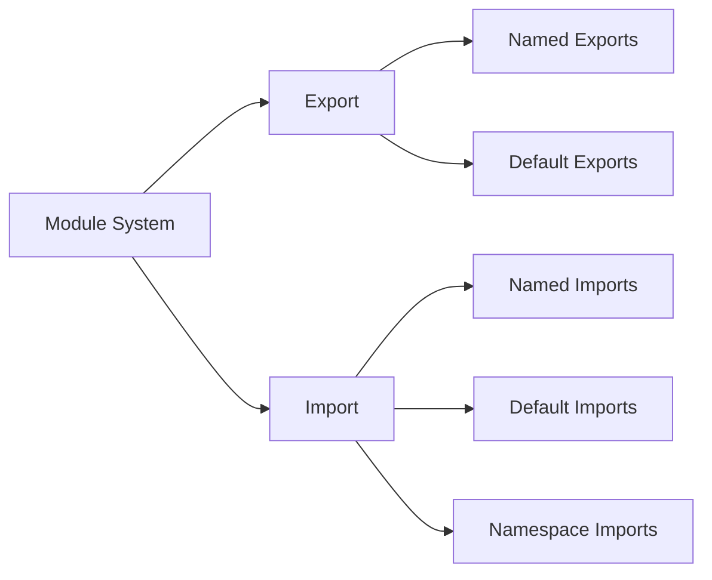

# JS-101
Master JavaScript fundamentals in one guide! Covers variables, functions, async/await, DOM manipulation, and ES6+ features. Includes project walkthroughs, FAQs, and practical examples. Perfect for beginners building real applications. Created by koffandaff (Dhruvil) to launch your coding career. Start learning today! 


# JavaScript 101: Complete Fundamentals Guide 

*A comprehensive guide by koffandaff (Dhruvil)*



## 📚 Table of Contents

## 📚 Table of Contents

- [1. Console & Comments](#1-console--comments)
- [2. Template Literals](#2-template-literals)
- [3. User Input (Node.js)](#3-user-input-nodejs)
- [4. Primitive Data Types](#4-primitive-data-types)
- [5. Variables (var, let, const)](#5-variables-var-let-const)
- [6. Type Conversion](#6-type-conversion)
- [7. Conditionals & Loops](#7-conditionals--loops)
- [8. Arrays & Objects](#8-arrays--objects)
- [9. Error Handling](#9-error-handling)
- [10. Functions](#10-functions)
- [11. NPM](#11-npm)
- [12. Arrow Functions](#12-arrow-functions)
- [13. Asynchronous JavaScript](#13-asynchronous-javascript)
- [14. Async/Await](#14-asyncawait)
- [15. DOM Manipulation](#15-dom-manipulation)
- [16. Fetch API](#16-fetch-api)
- [17. Modularization](#17-modularization)
- [18. Complete Code Walkthroughs](#18-complete-code-walkthroughs)
- [19. Key Differences & Gotchas](#19-key-differences--gotchas)
- [20. FAQ - Frequently Asked Questions](#20-faq---frequently-asked-questions)

---

## 1. Console & Comments

**Explanation:** The `console` is a developer tool for printing values, warnings, and errors. Comments are notes for humans that the computer ignores.

### Syntax:
```javascript
console.log(value);   // Standard output
console.warn(value);  // Warning (yellow)
console.error(value); // Error (red)

// Single-line comment

/*
  Multi-line
  comment
*/
```

### Use Cases:
- Debugging code
- Checking variable values
- Leaving reminders for yourself or teammates

### 🎯 Revision Task:
Write a script that logs your name, warns that a "file is missing," and throws an error "Failed to load data."

---

## 2. Template Literals

**Explanation:** Modern way to create strings that allows embedding variables directly.

### Syntax:
```javascript
const myVar = "world";
const myString = `Hello ${myVar}!`; // Use backticks ``
```

### Example:
```javascript
const version = 64;
console.log(`Version=${version}`); // Output: Version=64
```

### Use Cases:
- Building dynamic strings
- Creating file paths
- Generating user messages

### 🎯 Revision Task:
Create variables `item` (string) and `quantity` (number). Log: "You bought [quantity] [item]s."

---

## 3. User Input (Node.js)

**Explanation:** In Node.js environment, `prompt-sync` library pauses script execution for user input.

### Setup:
```bash
npm install prompt-sync
```

### Usage:
```javascript
const prompt = require("prompt-sync")();
const name = prompt("What is your name? ");
console.log(`Hi, ${name}!`);
```

### Use Cases:
- Command-line interface (CLI) tools
- Interactive scripts
- Learning and testing

---

## 4. Primitive Data Types



**Explanation:** The most basic data types in JavaScript.

| Type | Description | Example | `typeof` |
|------|-------------|---------|----------|
| **String** | Text data | `"hello"` | `"string"` |
| **Number** | Numeric values | `42`, `3.14` | `"number"` |
| **Boolean** | True/False values | `true`, `false` | `"boolean"` |
| **undefined** | Declared but not assigned | `let x;` | `"undefined"` |
| **null** | Intentional empty value | `let y = null;` | `"object"` |
| **BigInt** | Large integers | `9007199254740991n` | `"bigint"` |
| **Symbol** | Unique identifiers | `Symbol('id')` | `"symbol"` |

### 🎯 Revision Task:
Create one variable for each primitive type and log its `typeof`.

---

## 5. Variables (var, let, const)



### Comparison Table:

| Feature | `var` | `let` | `const` |
|---------|-------|-------|---------|
| **Scope** | Function | Block | Block |
| **Re-assign** | ✅ | ✅ | ❌ |
| **Redeclare** | ✅ | ❌ | ❌ |
| **Hoisting** | ✅ (undefined) | ❌ (TDZ) | ❌ (TDZ) |
| **Best Practice** | ❌ Avoid | ✅ When needed | ✅ Default |

### Examples:
```javascript
// ❌ var (avoid)
var oldWay = "deprecated";
var oldWay = "redeclared"; // Allowed - confusing!

// ✅ let (mutable variables)
let counter = 0;
counter = 1; // Allowed
// let counter = 2; // Error - cannot redeclare

// ✅ const (immutable reference)
const PI = 3.14159;
// PI = 3; // Error!

// Object/Array gotcha
const user = { name: "Alex" };
user.name = "Jordan"; // ✅ Allowed - modifying property
// user = { name: "Bob" }; // ❌ Error - re-assigning
```

### Best Practices:
1. **Always start with `const`**
2. **Use `let` only when re-assignment is needed**
3. **Avoid `var` in modern code**

---

## 6. Type Conversion

**Explanation:** Converting values from one type to another.

### Common Methods:
```javascript
Number("123");      // → 123
String(123);        // → "123"
parseInt("19.5px"); // → 19
parseFloat("19.5"); // → 19.5
Boolean(0);         // → false
```

### Truthy/Falsy Values:
```javascript
// Falsy: false, 0, "", null, undefined, NaN
// Truthy: Everything else
```

### Use Cases:
- Converting user input (always strings) to numbers
- Formatting data for display
- Data validation

### 🎯 Revision Task:
Convert `ageString = "25"` to number and add 10, then log result (should be `35`).

---

## 7. Conditionals & Loops

**Explanation:** Control flow tools for decision making and repetition.

### If/Else:
```javascript
if (score >= 90) {
    grade = 'A';
} else if (score >= 80) {
    grade = 'B';
} else {
    grade = 'C';
}
```

### Switch Statement:
```javascript
switch(day) {
    case 0: 
        console.log("Sunday");
        break;
    case 1:
        console.log("Monday");
        break;
    default:
        console.log("Other day");
}
```

### For Loop:
```javascript
// Initialization; Condition; Increment
for (let i = 0; i < 5; i++) {
    console.log(i); // 0, 1, 2, 3, 4
}
```

### While Loop:
```javascript
let count = 0;
while (count < 3) {
    console.log(count);
    count++;
}
```

### 🎯 Revision Task:
Create array `[10, 20, 30]`. Use `for` loop to log numbers greater than `15`.

---

## 8. Arrays & Objects



### Arrays (Ordered Lists):
```javascript
const fruits = ['apple', 'banana', 'orange'];
console.log(fruits[0]); // 'apple'
fruits.push('grape');   // Add to end
fruits.pop();           // Remove from end
fruits.map(fruit => fruit.toUpperCase()); // Transform
```

### Objects (Key-Value Pairs):
```javascript
const user = {
    name: "Alex",
    age: 25,
    isIntern: true,
    skills: ["JS", "HTML", "CSS"],
    // Method (function in object)
    greet() {
        return `Hello, I'm ${this.name}`;
    }
};

// Accessing properties
console.log(user.name);        // Dot notation
console.log(user['age']);      // Bracket notation

// Modifying
user.age = 26;
user.location = "Berlin";

// Destructuring
const { name, age } = user;
```

### Use Cases:
- **Arrays**: Lists of items (users, products, tasks)
- **Objects**: Single entities with properties (user profile, product details)

### 🎯 Revision Task:
Create a `car` object with `make`, `model`, and `year`. Log: "I have a [year] [make] [model]."

---

## 9. Error Handling

**Explanation:** Gracefully handle errors without crashing the application.

### Try/Catch Syntax:
```javascript
try {
    // Risky code that might fail
    dangerousOperation();
    console.log(nonExistentVariable);
} catch (error) {
    // Handle the error gracefully
    console.error("Something went wrong:", error.message);
} finally {
    // Always executes
    console.log("Cleanup complete");
}
```

### Custom Errors:
```javascript
throw new Error("Custom error message");
throw new SyntaxError("Invalid syntax");
```

### Use Cases:
- Network requests
- File operations
- User input validation
- Any external dependency

### 🎯 Revision Task:
Create `try...catch` block that attempts to log a non-existent variable.

---

## 10. Functions

**Explanation:** Reusable blocks of code that perform specific tasks.

### Function Declaration:
```javascript
function greet(name) {
    return `Hello, ${name}!`;
}
const greeting = greet("Alex"); // "Hello, Alex!"
```

### Function Expression:
```javascript
const greet = function(name) {
    return `Hello, ${name}!`;
};
```

### Parameters & Default Values:
```javascript
function calculate(total, tax = 0.1, discount = 0) {
    return total * (1 + tax) - discount;
}
```

### Use Cases:
- Code organization and reusability
- Reducing duplication
- Modular programming

---

## 11. NPM

**Explanation:** Node Package Manager - tool for managing JavaScript packages.

### Essential Commands:
```bash
npm init -y                    # Create package.json
npm install package-name       # Install package
npm install                    # Install all dependencies
npm uninstall package-name     # Remove package
npm run script-name            # Run custom script
```

### Example Workflow:
```bash
mkdir my-project
cd my-project
npm init -y
npm install prompt-sync
```

### package.json scripts:
```json
{
  "scripts": {
    "start": "node app.js",
    "dev": "node --watch app.js",
    "test": "echo \"Error: no test specified\""
  }
}
```

---

## 12. Arrow Functions



**Explanation:** Modern, concise function syntax essential for React and modern JS. Arrow functions provide shorter syntax and don't have their own `this` context.

### Syntax Comparison:
```javascript
// Traditional Function Expression
const add = function(a, b) {
    return a + b;
};

// Arrow Function Equivalent
const addArrow = (a, b) => {
    return a + b;
};
```

### Key Features:

#### 1. Implicit Return (Single Expression):
```javascript
// No braces needed for single expressions
const add = (a, b) => a + b;
const double = n => n * 2;
const getTime = () => new Date().getHours();
```

#### 2. Single Parameter (No Parentheses):
```javascript
// Parentheses optional for single parameter
const square = x => x * x;
const greet = name => `Hello, ${name}!`;
const logMessage = msg => console.log(msg);
```

#### 3. Lexical `this` Binding:
```javascript
const obj = {
    name: "JavaScript",
    traditional: function() {
        console.log(this.name); // "JavaScript" - has own this
    },
    arrow: () => {
        console.log(this.name); // undefined - uses parent's this
    }
};
```

### Important Limitations:
- No `arguments` object (use rest parameters instead)
- Cannot be used as constructors with `new`
- No `yield` keyword (cannot be generator functions)

### Use Cases:
- **Array methods**: `array.map(x => x * 2)`
- **Event handlers**: `button.addEventListener('click', () => {...})`
- **Promise chains**: `.then(data => process(data))`
- **React components**: `const Component = () => <div>Hello</div>`

### 🎯 Revision Task:
Convert these traditional functions to arrow functions:
```javascript
// 1. Simple function
function multiply(a, b) {
    return a * b;
}

// 2. Function with one parameter
function welcomeUser(username) {
    return `Welcome, ${username}!`;
}

// 3. No parameters
function getCurrentYear() {
    return new Date().getFullYear();
}
```

---

## 13. Asynchronous JavaScript



**Explanation:** Promises represent the eventual completion (or failure) of an asynchronous operation and its resulting value. They help avoid "callback hell" and make async code more readable.


### Promise States:
1. **`pending`**: Operation in progress
2. **`fulfilled`**: Operation completed successfully ✅
3. **`rejected`**: Operation failed ❌

### Creating Promises:
```javascript
const myPromise = new Promise((resolve, reject) => {
    // Async operation
    if (success) {
        resolve("Data loaded!");
    } else {
        reject("Error loading data");
    }
});
```

### .then() & .catch():
```javascript
fetch('https://api.example.com/data')
    .then(response => {
        console.log("Success!", response);
        return response.json();
    })
    .then(data => {
        console.log("Data:", data);
    })
    .catch(error => {
        console.error("Failed:", error);
    })
    .finally(() => {
        console.log("Request completed");
    });
```

### Promise Methods:
```javascript
Promise.all([promise1, promise2])       // All must succeed
Promise.race([promise1, promise2])      // First to settle
Promise.any([promise1, promise2])       // First to succeed
```

### Use Cases:
- API calls
- File operations
- Timers
- Any I/O operations

---

## 14. Async/Await

**Explanation:** Modern syntax that makes asynchronous code look synchronous.

### Keywords:
- **`async`**: Declares an asynchronous function
- **`await`**: Pauses execution until Promise resolves

### Basic Pattern:
```javascript
async function fetchData() {
    try {
        const response = await fetch('https://api.example.com/data');
        const data = await response.json();
        console.log(data);
        return data;
    } catch (error) {
        console.error("Failed:", error);
    }
}
```

### Error Handling:
```javascript
async function safeFetch() {
    try {
        const response = await fetch(url);
        if (!response.ok) {
            throw new Error(`HTTP error! status: ${response.status}`);
        }
        return await response.json();
    } catch (error) {
        console.error("Fetch failed:", error);
        return null;
    }
}
```

### Multiple Parallel Requests:
```javascript
async function fetchMultiple() {
    try {
        const [user, posts] = await Promise.all([
            fetch('/api/user'),
            fetch('/api/posts')
        ]);
        // Process both results
    } catch (error) {
        console.error("One request failed", error);
    }
}
```

### 🎯 Revision Task:
Write `async function getUser()` that fetches from `'https://api.github.com/users/github'` and logs the data.

---

## 15. DOM Manipulation



**Explanation:** JavaScript interface to interact with HTML documents.

### 1. Selecting Elements:
```javascript
// Modern (recommended)
const element = document.querySelector('#id');
const elements = document.querySelectorAll('.class');

// Traditional
const byId = document.getElementById('myId');
const byClass = document.getElementsByClassName('my-class');
```

### 2. Modifying Content:
```javascript
// ✅ Safe - inserts plain text
element.textContent = "Hello World";
element.innerText = "Hello World"; // Similar, but aware of styling

// ⚠️ Dangerous - parses HTML (security risk)
element.innerHTML = "<strong>Hello</strong> World";

// ✅ Safe HTML insertion
element.insertAdjacentHTML('beforeend', '<span>Safe</span>');
```

### 3. Event Handling:
```javascript
const button = document.querySelector('#my-button');

// Click event
button.addEventListener('click', (event) => {
    console.log('Button clicked!', event);
    event.preventDefault(); // Prevent default behavior
    event.stopPropagation(); // Stop event bubbling
});

// Form submission
form.addEventListener('submit', (event) => {
    event.preventDefault();
    // Handle form data
});

// Keyboard events
input.addEventListener('keyup', (event) => {
    if (event.key === 'Enter') {
        // Handle enter key
    }
});
```

### 4. Creating Elements:
```javascript
// Create new element
const newDiv = document.createElement('div');
newDiv.textContent = "I'm new!";
newDiv.className = "my-class";

// Add to DOM
parentElement.appendChild(newDiv);
container.prepend(newDiv); // Add at beginning
existingElement.insertAdjacentElement('afterend', newDiv);
```

### 5. Form Input:
```javascript
const input = document.querySelector('#username');
const username = input.value; // Get user input

const checkbox = document.querySelector('#subscribe');
const isSubscribed = checkbox.checked; // Get checkbox state

const form = document.querySelector('#login-form');
form.addEventListener('submit', (event) => {
    event.preventDefault(); // Prevent page reload
    const formData = new FormData(form);
    // Process form data
});
```

### 🎯 Revision Task:
Given `<div id="profile"></div>` and `<input id="name-in" value="Alex">`, write JS to:
1. Select both elements
2. Get input value
3. Set div content to that value

---

## 16. Fetch API

**Explanation:** Modern, Promise-based API for making HTTP requests.

### Standard GET Request:
```javascript
async function getCafeterias(query) {
    const url = `https://api.cafes.com/search?q=${encodeURIComponent(query)}`;
    
    try {
        const response = await fetch(url);
        
        // Check if request was successful
        if (!response.ok) {
            throw new Error(`HTTP error! Status: ${response.status}`);
        }
        
        const data = await response.json();
        return data;
    } catch (error) {
        console.error("Fetch failed:", error);
        return null;
    }
}
```

### POST Request:
```javascript
async function postData(url, data) {
    try {
        const response = await fetch(url, {
            method: 'POST',
            headers: {
                'Content-Type': 'application/json',
                'Authorization': 'Bearer token123'
            },
            body: JSON.stringify(data),
        });
        
        if (!response.ok) throw new Error('Network response was not ok');
        return await response.json();
    } catch (error) {
        console.error('Error:', error);
    }
}
```

### File Upload:
```javascript
async function uploadFile(file) {
    const formData = new FormData();
    formData.append('file', file);
    
    const response = await fetch('/api/upload', {
        method: 'POST',
        body: formData,
        // Don't set Content-Type - browser will set it with boundary
    });
    
    return await response.json();
}
```

### Error Handling Patterns:
```javascript
async function robustFetch(url, options = {}) {
    try {
        const response = await fetch(url, {
            timeout: 5000,
            ...options
        });
        
        if (!response.ok) {
            throw new Error(`HTTP ${response.status}: ${response.statusText}`);
        }
        
        const contentType = response.headers.get('content-type');
        if (contentType?.includes('application/json')) {
            return await response.json();
        } else {
            return await response.text();
        }
    } catch (error) {
        if (error.name === 'TypeError') {
            console.error('Network error - check URL or connection');
        } else {
            console.error('Fetch error:', error);
        }
        throw error; // Re-throw for caller to handle
    }
}
```

### 🎯 Revision Task:
Write `async function searchMusic(artistName)` that fetches from `https://itunes.apple.com/search?term=${artistName}` and logs the results.

---

## 17. Modularization



**Explanation:** Split code into reusable, organized modules.

### Named Exports/Imports:

#### `helpers.js` (Module):
```javascript
// Export individual values
export const PI = 3.14;

// Export functions
export function add(a, b) {
    return a + b;
}

export function multiply(a, b) {
    return a * b;
}

// Export at the end
const secretKey = '123';
export { secretKey };
```

#### `main.js` (Main Script):
```javascript
// Import specific exports
import { PI, add, multiply } from './helpers.js';

// Import with aliases
import { add as addNumbers } from './helpers.js';

// Import everything
import * as helpers from './helpers.js';

console.log(PI); // 3.14
console.log(add(5, 10)); // 15
console.log(helpers.multiply(3, 7)); // 21
```

### Default Exports:

#### `math.js`:
```javascript
const calculator = {
    add: (a, b) => a + b,
    subtract: (a, b) => a - b
};

// One default export per file
export default calculator;
```

#### `app.js`:
```javascript
// Import default (any name)
import calc from './math.js';
import myCalculator from './math.js'; // Also works

console.log(calc.add(2, 3)); // 5
```

### Mixed Exports:
```javascript
// config.js
export const API_URL = 'https://api.example.com';
export const TIMEOUT = 5000;

const config = {
    version: '1.0',
    environment: 'development'
};

export default config;
```

```javascript
// app.js
import config, { API_URL, TIMEOUT } from './config.js';
```

### Use Cases:
- Organizing large codebases
- Reusable utility functions
- Separation of concerns
- Team collaboration

### 🎯 Revision Task:
1. Create `math.js` that exports `multiply(a, b)`
2. Create `app.js` that imports and uses it to log 5 * 5

---

## 18. Complete Code Walkthroughs

### Walkthrough 1: Search Bar with API Integration

```javascript
// 1. Select all elements we need
const searchButton = document.querySelector('#search-button');
const searchInput = document.querySelector('#search-input');
const resultsDiv = document.querySelector('#results-container');
const loadingSpinner = document.querySelector('#loading-spinner');

// 2. Add the async event listener
searchButton.addEventListener('click', async () => {
  
  // 3. Get the user's input and validate
  const searchText = searchInput.value.trim();
  if (!searchText) {
    resultsDiv.textContent = "Please enter a search term";
    return;
  }

  // 4. Show loading state
  loadingSpinner.style.display = 'block';
  resultsDiv.textContent = '';
  const url = `https://api.example.com/search?q=${encodeURIComponent(searchText)}`;

  // 5. Start the 'try' block for safety
  try {
    // 6. Wait for the server's response with timeout
    const response = await fetch(url, { 
      signal: AbortSignal.timeout(5000) // 5 second timeout
    });
    
    // 7. Check if request was successful
    if (!response.ok) {
      throw new Error(`Server error: ${response.status}`);
    }
    
    // 8. Wait to parse the JSON data
    const data = await response.json(); 
    
    // 9. SUCCESS: Display the data!
    if (data.results && data.results.length > 0) {
      resultsDiv.innerHTML = data.results
        .map(item => `<div class="result-item">${item.name}</div>`)
        .join('');
    } else {
      resultsDiv.textContent = "No results found";
    }

  } catch (error) {
    // 10. FAIL: Display appropriate error message
    console.error("Fetch failed!", error);
    if (error.name === 'TimeoutError') {
      resultsDiv.textContent = "Request timed out. Please try again.";
    } else if (error.name === 'TypeError') {
      resultsDiv.textContent = "Network error. Check your connection.";
    } else {
      resultsDiv.textContent = "Sorry, we couldn't find any results.";
    }
  } finally {
    // 11. Always hide loading spinner
    loadingSpinner.style.display = 'none';
  }
});
```

### Walkthrough 2: Todo List Application

```javascript
class TodoApp {
  constructor() {
    this.todos = JSON.parse(localStorage.getItem('todos')) || [];
    this.init();
  }

  init() {
    this.todoInput = document.querySelector('#todo-input');
    this.addButton = document.querySelector('#add-button');
    this.todoList = document.querySelector('#todo-list');
    this.filterButtons = document.querySelectorAll('.filter-btn');

    this.addButton.addEventListener('click', () => this.addTodo());
    this.todoInput.addEventListener('keypress', (e) => {
      if (e.key === 'Enter') this.addTodo();
    });

    this.filterButtons.forEach(btn => {
      btn.addEventListener('click', (e) => this.filterTodos(e.target.dataset.filter));
    });

    this.render();
  }

  addTodo() {
    const text = this.todoInput.value.trim();
    if (!text) return;

    const newTodo = {
      id: Date.now(),
      text: text,
      completed: false,
      createdAt: new Date().toISOString()
    };

    this.todos.push(newTodo);
    this.saveToLocalStorage();
    this.todoInput.value = '';
    this.render();
  }

  toggleTodo(id) {
    this.todos = this.todos.map(todo =>
      todo.id === id ? { ...todo, completed: !todo.completed } : todo
    );
    this.saveToLocalStorage();
    this.render();
  }

  deleteTodo(id) {
    this.todos = this.todos.filter(todo => todo.id !== id);
    this.saveToLocalStorage();
    this.render();
  }

  filterTodos(filter) {
    let filteredTodos = this.todos;
    
    switch(filter) {
      case 'active':
        filteredTodos = this.todos.filter(todo => !todo.completed);
        break;
      case 'completed':
        filteredTodos = this.todos.filter(todo => todo.completed);
        break;
      // 'all' shows everything
    }

    this.render(filteredTodos);
  }

  render(todosToShow = this.todos) {
    this.todoList.innerHTML = todosToShow
      .map(todo => `
        <li class="todo-item ${todo.completed ? 'completed' : ''}">
          <input 
            type="checkbox" 
            ${todo.completed ? 'checked' : ''}
            onchange="app.toggleTodo(${todo.id})"
          >
          <span class="todo-text">${this.escapeHtml(todo.text)}</span>
          <button onclick="app.deleteTodo(${todo.id})" class="delete-btn">×</button>
        </li>
      `).join('');

    this.updateStats();
  }

  updateStats() {
    const total = this.todos.length;
    const completed = this.todos.filter(todo => todo.completed).length;
    const remaining = total - completed;

    document.querySelector('#todo-stats').textContent = 
      `${remaining} remaining out of ${total} tasks`;
  }

  escapeHtml(text) {
    const div = document.createElement('div');
    div.textContent = text;
    return div.innerHTML;
  }

  saveToLocalStorage() {
    localStorage.setItem('todos', JSON.stringify(this.todos));
  }
}

// Initialize the app
const app = new TodoApp();
```

### Walkthrough 3: Weather Dashboard

```javascript
// weather.js
class WeatherDashboard {
  constructor() {
    this.apiKey = 'your-api-key-here';
    this.currentWeatherEl = document.querySelector('#current-weather');
    this.forecastEl = document.querySelector('#forecast');
    this.searchForm = document.querySelector('#search-form');
    this.loadingEl = document.querySelector('#loading');
    this.errorEl = document.querySelector('#error');

    this.searchForm.addEventListener('submit', (e) => this.handleSearch(e));
    this.loadLastSearchedCity();
  }

  async handleSearch(event) {
    event.preventDefault();
    const cityInput = document.querySelector('#city-input');
    const city = cityInput.value.trim();

    if (!city) return;

    await this.fetchWeatherData(city);
    this.saveLastSearchedCity(city);
    cityInput.value = '';
  }

  async fetchWeatherData(city) {
    this.showLoading();
    this.hideError();

    try {
      const [currentResponse, forecastResponse] = await Promise.all([
        fetch(`https://api.openweathermap.org/data/2.5/weather?q=${city}&appid=${this.apiKey}&units=metric`),
        fetch(`https://api.openweathermap.org/data/2.5/forecast?q=${city}&appid=${this.apiKey}&units=metric`)
      ]);

      if (!currentResponse.ok || !forecastResponse.ok) {
        throw new Error('City not found');
      }

      const currentData = await currentResponse.json();
      const forecastData = await forecastResponse.json();

      this.displayCurrentWeather(currentData);
      this.displayForecast(forecastData);

    } catch (error) {
      this.showError('Failed to fetch weather data. Please try again.');
      console.error('Weather API error:', error);
    } finally {
      this.hideLoading();
    }
  }

  displayCurrentWeather(data) {
    const { name, main, weather, wind } = data;
    
    this.currentWeatherEl.innerHTML = `
      <div class="weather-card">
        <h2>${name}</h2>
        <div class="weather-main">
          
          <div class="temperature">${Math.round(main.temp)}°C</div>
        </div>
        <div class="weather-details">
          <p>Feels like: ${Math.round(main.feels_like)}°C</p>
          <p>Humidity: ${main.humidity}%</p>
          <p>Wind: ${wind.speed} m/s</p>
          <p>${weather[0].description}</p>
        </div>
      </div>
    `;
  }

  displayForecast(data) {
    // Group forecast by day and take one reading per day
    const dailyForecasts = data.list.filter((reading, index) => index % 8 === 0).slice(0, 5);

    this.forecastEl.innerHTML = `
      <h3>5-Day Forecast</h3>
      <div class="forecast-container">
        ${dailyForecasts.map(day => `
          <div class="forecast-day">
            <div class="date">${new Date(day.dt * 1000).toLocaleDateString('en-US', { weekday: 'short' })}</div>
            
            <div class="temp">${Math.round(day.main.temp)}°C</div>
            <div class="description">${day.weather[0].description}</div>
          </div>
        `).join('')}
      </div>
    `;
  }

  showLoading() {
    this.loadingEl.style.display = 'block';
  }

  hideLoading() {
    this.loadingEl.style.display = 'none';
  }

  showError(message) {
    this.errorEl.textContent = message;
    this.errorEl.style.display = 'block';
  }

  hideError() {
    this.errorEl.style.display = 'none';
  }

  saveLastSearchedCity(city) {
    localStorage.setItem('lastSearchedCity', city);
  }

  loadLastSearchedCity() {
    const lastCity = localStorage.getItem('lastSearchedCity');
    if (lastCity) {
      this.fetchWeatherData(lastCity);
    }
  }
}

// Initialize weather dashboard
const weatherApp = new WeatherDashboard();
```

### Walkthrough 4: Form Validation System

```javascript
// form-validation.js
class FormValidator {
  constructor(formId) {
    this.form = document.getElementById(formId);
    this.fields = {};
    this.errors = {};
    
    this.init();
  }

  init() {
    // Find all fields with data-validation attribute
    const validationFields = this.form.querySelectorAll('[data-validation]');
    
    validationFields.forEach(field => {
      const fieldName = field.name;
      const validationRules = field.dataset.validation.split('|');
      
      this.fields[fieldName] = {
        element: field,
        rules: validationRules,
        errors: []
      };

      // Add real-time validation on input
      field.addEventListener('blur', () => this.validateField(fieldName));
      field.addEventListener('input', () => this.clearFieldError(fieldName));
    });

    // Form submission
    this.form.addEventListener('submit', (e) => this.handleSubmit(e));
  }

  validateField(fieldName) {
    const field = this.fields[fieldName];
    const value = field.element.value.trim();
    field.errors = [];

    field.rules.forEach(rule => {
      const [ruleName, ruleValue] = rule.split(':');
      
      switch(ruleName) {
        case 'required':
          if (!value) field.errors.push('This field is required');
          break;
          
        case 'min':
          if (value.length < parseInt(ruleValue)) {
            field.errors.push(`Must be at least ${ruleValue} characters`);
          }
          break;
          
        case 'max':
          if (value.length > parseInt(ruleValue)) {
            field.errors.push(`Must be less than ${ruleValue} characters`);
          }
          break;
          
        case 'email':
          if (value && !this.isValidEmail(value)) {
            field.errors.push('Please enter a valid email address');
          }
          break;
          
        case 'password':
          if (value && !this.isValidPassword(value)) {
            field.errors.push('Password must contain letters and numbers');
          }
          break;
          
        case 'match':
          const matchField = this.fields[ruleValue];
          if (matchField && value !== matchField.element.value) {
            field.errors.push('Fields do not match');
          }
          break;
      }
    });

    this.displayFieldErrors(fieldName);
    return field.errors.length === 0;
  }

  isValidEmail(email) {
    const emailRegex = /^[^\s@]+@[^\s@]+\.[^\s@]+$/;
    return emailRegex.test(email);
  }

  isValidPassword(password) {
    // At least one letter and one number
    const passwordRegex = /^(?=.*[A-Za-z])(?=.*\d)/;
    return passwordRegex.test(password);
  }

  displayFieldErrors(fieldName) {
    const field = this.fields[fieldName];
    const errorElement = this.getErrorElement(field.element);
    
    // Remove existing error classes
    field.element.classList.remove('error');
    if (errorElement) errorElement.remove();

    if (field.errors.length > 0) {
      field.element.classList.add('error');
      
      const errorDiv = document.createElement('div');
      errorDiv.className = 'error-message';
      errorDiv.textContent = field.errors[0];
      
      field.element.parentNode.appendChild(errorDiv);
    }
  }

  clearFieldError(fieldName) {
    const field = this.fields[fieldName];
    field.element.classList.remove('error');
    
    const errorElement = this.getErrorElement(field.element);
    if (errorElement) errorElement.remove();
  }

  getErrorElement(fieldElement) {
    return fieldElement.parentNode.querySelector('.error-message');
  }

  validateAll() {
    let isValid = true;
    
    Object.keys(this.fields).forEach(fieldName => {
      const fieldValid = this.validateField(fieldName);
      if (!fieldValid) isValid = false;
    });
    
    return isValid;
  }

  async handleSubmit(event) {
    event.preventDefault();
    
    if (this.validateAll()) {
      // Show loading state
      const submitButton = this.form.querySelector('button[type="submit"]');
      const originalText = submitButton.textContent;
      submitButton.textContent = 'Submitting...';
      submitButton.disabled = true;

      try {
        // Simulate API call
        const formData = new FormData(this.form);
        const data = Object.fromEntries(formData);
        
        await this.submitForm(data);
        
        this.showSuccess('Form submitted successfully!');
        this.form.reset();
        
      } catch (error) {
        this.showError('Submission failed. Please try again.');
      } finally {
        submitButton.textContent = originalText;
        submitButton.disabled = false;
      }
    }
  }

  async submitForm(data) {
    // Simulate API call
    return new Promise((resolve, reject) => {
      setTimeout(() => {
        // Simulate random success/failure
        Math.random() > 0.2 ? resolve() : reject();
      }, 1500);
    });
  }

  showSuccess(message) {
    this.showMessage(message, 'success');
  }

  showError(message) {
    this.showMessage(message, 'error');
  }

  showMessage(message, type) {
    // Remove existing messages
    const existingMessage = this.form.querySelector('.form-message');
    if (existingMessage) existingMessage.remove();

    const messageDiv = document.createElement('div');
    messageDiv.className = `form-message ${type}`;
    messageDiv.textContent = message;
    
    this.form.prepend(messageDiv);
    
    // Auto-remove after 5 seconds
    setTimeout(() => {
      messageDiv.remove();
    }, 5000);
  }
}

// Initialize form validation
const signupForm = new FormValidator('signup-form');
const loginForm = new FormValidator('login-form');
```

### Walkthrough 5: Real-time Chat Application

```javascript
// chat-app.js
class ChatApplication {
  constructor() {
    this.messages = [];
    this.currentUser = this.getCurrentUser();
    this.socket = null;
    this.isConnected = false;
    
    this.init();
  }

  init() {
    this.messageList = document.querySelector('#message-list');
    this.messageInput = document.querySelector('#message-input');
    this.sendButton = document.querySelector('#send-button');
    this.userList = document.querySelector('#user-list');
    this.connectionStatus = document.querySelector('#connection-status');

    this.setupEventListeners();
    this.connectToWebSocket();
    this.loadPreviousMessages();
  }

  setupEventListeners() {
    this.sendButton.addEventListener('click', () => this.sendMessage());
    this.messageInput.addEventListener('keypress', (e) => {
      if (e.key === 'Enter' && !e.shiftKey) {
        e.preventDefault();
        this.sendMessage();
      }
    });

    // Auto-resize textarea
    this.messageInput.addEventListener('input', () => {
      this.messageInput.style.height = 'auto';
      this.messageInput.style.height = Math.min(this.messageInput.scrollHeight, 120) + 'px';
    });
  }

  connectToWebSocket() {
    try {
      this.socket = new WebSocket('wss://echo.websocket.org'); // Demo endpoint
      
      this.socket.onopen = () => {
        this.isConnected = true;
        this.updateConnectionStatus('connected');
        console.log('WebSocket connected');
      };

      this.socket.onmessage = (event) => {
        const message = JSON.parse(event.data);
        this.handleIncomingMessage(message);
      };

      this.socket.onclose = () => {
        this.isConnected = false;
        this.updateConnectionStatus('disconnected');
        console.log('WebSocket disconnected');
        
        // Attempt reconnect after 3 seconds
        setTimeout(() => this.connectToWebSocket(), 3000);
      };

      this.socket.onerror = (error) => {
        console.error('WebSocket error:', error);
        this.updateConnectionStatus('error');
      };

    } catch (error) {
      console.error('Failed to connect:', error);
      this.updateConnectionStatus('error');
    }
  }

  sendMessage() {
    const text = this.messageInput.value.trim();
    if (!text || !this.isConnected) return;

    const message = {
      id: this.generateId(),
      text: text,
      user: this.currentUser,
      timestamp: new Date().toISOString(),
      type: 'text'
    };

    // Add to local messages immediately for fast UI
    this.addMessageToUI(message);
    this.messages.push(message);
    this.saveMessages();

    // Send via WebSocket
    this.socket.send(JSON.stringify(message));

    // Clear input and reset height
    this.messageInput.value = '';
    this.messageInput.style.height = 'auto';

    // Scroll to bottom
    this.scrollToBottom();
  }

  handleIncomingMessage(message) {
    // Avoid duplicates
    if (this.messages.find(msg => msg.id === message.id)) return;

    this.addMessageToUI(message);
    this.messages.push(message);
    this.saveMessages();

    // Show notification if tab is not active
    if (document.hidden) {
      this.showNotification(message);
    }
  }

  addMessageToUI(message) {
    const messageElement = document.createElement('div');
    messageElement.className = `message ${message.user.id === this.currentUser.id ? 'own-message' : 'other-message'}`;
    
    messageElement.innerHTML = `
      <div class="message-header">
        <span class="username">${this.escapeHtml(message.user.name)}</span>
        <span class="timestamp">${this.formatTime(message.timestamp)}</span>
      </div>
      <div class="message-content">${this.escapeHtml(message.text)}</div>
    `;

    this.messageList.appendChild(messageElement);
    this.scrollToBottom();
  }

  scrollToBottom() {
    this.messageList.scrollTop = this.messageList.scrollHeight;
  }

  loadPreviousMessages() {
    const savedMessages = localStorage.getItem('chat-messages');
    if (savedMessages) {
      this.messages = JSON.parse(savedMessages);
      this.messages.forEach(message => this.addMessageToUI(message));
    }
  }

  saveMessages() {
    // Keep only last 100 messages to avoid storage issues
    const recentMessages = this.messages.slice(-100);
    localStorage.setItem('chat-messages', JSON.stringify(recentMessages));
  }

  updateConnectionStatus(status) {
    const statusMap = {
      connected: { text: 'Connected', class: 'connected' },
      disconnected: { text: 'Disconnected', class: 'disconnected' },
      error: { text: 'Connection Error', class: 'error' }
    };

    const statusInfo = statusMap[status];
    this.connectionStatus.textContent = statusInfo.text;
    this.connectionStatus.className = `status ${statusInfo.class}`;
  }

  showNotification(message) {
    if ('Notification' in window && Notification.permission === 'granted') {
      new Notification(`New message from ${message.user.name}`, {
        body: message.text,
        icon: '/icon.png'
      });
    }
  }

  requestNotificationPermission() {
    if ('Notification' in window && Notification.permission === 'default') {
      Notification.requestPermission();
    }
  }

  getCurrentUser() {
    let user = localStorage.getItem('chat-user');
    if (!user) {
      user = {
        id: this.generateId(),
        name: `User${Math.floor(Math.random() * 1000)}`,
        color: this.generateRandomColor()
      };
      localStorage.setItem('chat-user', JSON.stringify(user));
    } else {
      user = JSON.parse(user);
    }
    return user;
  }

  generateId() {
    return Date.now().toString(36) + Math.random().toString(36).substr(2);
  }

  generateRandomColor() {
    return '#' + Math.floor(Math.random() * 16777215).toString(16);
  }

  formatTime(timestamp) {
    return new Date(timestamp).toLocaleTimeString('en-US', {
      hour: '2-digit',
      minute: '2-digit'
    });
  }

  escapeHtml(text) {
    const div = document.createElement('div');
    div.textContent = text;
    return div.innerHTML;
  }
}

// Initialize chat application
const chatApp = new ChatApplication();

// Request notification permission on user interaction
document.addEventListener('click', () => {
  chatApp.requestNotificationPermission();
});
```

---

## 19. Key Differences & Gotchas

### 1. == vs ===
```javascript
0 == false     // true (type coercion)
0 === false    // false (strict equality)
"" == false    // true
"" === false   // false
null == undefined  // true
null === undefined // false
```

### 2. Array Comparison
```javascript
[] == []     // false (different references)
[] === []    // false
[1,2] == [1,2] // false
```

### 3. Hoisting Differences
```javascript
// var - hoisted and initialized with undefined
console.log(x); // undefined
var x = 5;

// let/const - hoisted but in Temporal Dead Zone
console.log(y); // ReferenceError
let y = 5;
```

### 4. Function vs Arrow Function `this`
```javascript
const obj = {
  name: "Test",
  regularFunc: function() {
    console.log(this.name); // "Test"
  },
  arrowFunc: () => {
    console.log(this.name); // undefined (lexical scope)
  }
};
```

### 5. Object Reference vs Value
```javascript
let a = { value: 1 };
let b = a;          // Reference, not copy
b.value = 2;
console.log(a.value); // 2 (both changed)

// Shallow copy
let c = { ...a };   // Spread operator
c.value = 3;
console.log(a.value); // 2 (original unchanged)
```

### 6. Async/Await vs Promises
```javascript
// Both are equivalent:
async function example() {
  const result = await fetchData();
  return result;
}

function example() {
  return fetchData().then(result => result);
}
```

### 7. Closure Gotchas
```javascript
for (var i = 0; i < 3; i++) {
  setTimeout(() => console.log(i), 100); // 3, 3, 3
}

for (let i = 0; i < 3; i++) {
  setTimeout(() => console.log(i), 100); // 0, 1, 2
}
```

---

## 20. FAQ - Frequently Asked Questions

### **Basic Concepts**

**Q1: What's the difference between `null` and `undefined`?**
```javascript
// undefined - variable declared but not assigned
let a;
console.log(a); // undefined

// null - intentional absence of value
let b = null;
console.log(b); // null

// Typeof difference
typeof undefined; // "undefined"
typeof null;      // "object" (historical bug)
```

**Q2: When should I use `let` vs `const`?**
- **Use `const` by default** - for all variables that won't be reassigned
- **Use `let` only when** you need to reassign the variable
- **Never use `var`** in modern code

**Q3: Why does `0.1 + 0.2 !== 0.3`?**
```javascript
console.log(0.1 + 0.2); // 0.30000000000000004
// Solution: Use tolerance for floating point comparisons
Math.abs(0.1 + 0.2 - 0.3) < Number.EPSILON; // true
```

### **Functions & Scope**

**Q4: What's the difference between function declaration and expression?**
```javascript
// Declaration - hoisted
console.log(square(5)); // Works
function square(n) { return n * n; }

// Expression - not hoisted
console.log(square(5)); // Error
const square = function(n) { return n * n; };
```

**Q5: How do closures work?**
```javascript
function createCounter() {
  let count = 0; // Private variable
  return function() {
    count++;
    return count;
  };
}

const counter = createCounter();
console.log(counter()); // 1
console.log(counter()); // 2
// `count` is preserved between calls
```

**Q6: What is the "this" keyword and how does it work?**
```javascript
// Depends on how function is called:
const obj = {
  name: "My Object",
  regular: function() { return this.name; }, // "My Object"
  arrow: () => this.name,                    // undefined (window/global)
  method() { return this.name; }             // "My Object"
};
```

### **Arrays & Objects**

**Q7: What's the difference between shallow and deep copy?**
```javascript
const original = { a: 1, b: { c: 2 } };

// Shallow copy - nested objects still referenced
const shallow = { ...original };
shallow.b.c = 99;
console.log(original.b.c); // 99 (changed!)

// Deep copy - complete copy
const deep = JSON.parse(JSON.stringify(original));
deep.b.c = 100;
console.log(original.b.c); // 99 (unchanged)
```

**Q8: How do I remove duplicates from an array?**
```javascript
const numbers = [1, 2, 2, 3, 4, 4, 5];

// Method 1: Set (modern)
const unique1 = [...new Set(numbers)];

// Method 2: filter
const unique2 = numbers.filter((item, index) => 
  numbers.indexOf(item) === index
);

// Method 3: reduce
const unique3 = numbers.reduce((acc, curr) => 
  acc.includes(curr) ? acc : [...acc, curr], []
);
```

### **Asynchronous JavaScript**

**Q9: What's the difference between Promises and async/await?**
```javascript
// Promises
function fetchData() {
  return fetch(url)
    .then(response => response.json())
    .then(data => console.log(data))
    .catch(error => console.error(error));
}

// Async/await (syntactic sugar)
async function fetchData() {
  try {
    const response = await fetch(url);
    const data = await response.json();
    console.log(data);
  } catch (error) {
    console.error(error);
  }
}
// Both do the same thing, async/await is easier to read
```

**Q10: How do I handle multiple async operations?**
```javascript
// Sequential (one after another)
const result1 = await asyncTask1();
const result2 = await asyncTask2();

// Parallel (all at once)
const [result1, result2] = await Promise.all([
  asyncTask1(),
  asyncTask2()
]);

// Race (first to finish wins)
const result = await Promise.race([
  asyncTask1(),
  asyncTask2()
]);
```

### **DOM & Browser APIs**

**Q11: What's the difference between `textContent` and `innerHTML`?**
```javascript
const element = document.getElementById('myElement');

// textContent - safe, fast, plain text
element.textContent = "<script>alert('xss')</script>";
// Renders as text: "<script>alert('xss')</script>"

// innerHTML - dangerous, parses HTML
element.innerHTML = "<strong>Hello</strong>";
// Renders as HTML: Hello (bold)
// Security risk with user input!
```

**Q12: How do I debounce user input?**
```javascript
function debounce(func, delay) {
  let timeoutId;
  return function(...args) {
    clearTimeout(timeoutId);
    timeoutId = setTimeout(() => func.apply(this, args), delay);
  };
}

const searchInput = document.querySelector('#search');
searchInput.addEventListener('input', debounce((e) => {
  console.log('Searching for:', e.target.value);
}, 300));
```

### **Advanced Concepts**

**Q13: What is the Event Loop and how does it work?**
```javascript
console.log('Start');

setTimeout(() => console.log('Timeout'), 0);

Promise.resolve().then(() => console.log('Promise'));

console.log('End');

// Output order:
// Start
// End
// Promise
// Timeout
```
*Explanation: Microtasks (Promises) run before Macrotasks (setTimeout)*

**Q14: How does JavaScript handle memory management?**
```javascript
// Memory leak example
let elements = [];
function createLeak() {
  const div = document.createElement('div');
  elements.push(div); // div never gets garbage collected
}

// Proper cleanup
function createElement() {
  const div = document.createElement('div');
  // Use WeakRef or proper cleanup
  return div;
}
```

**Q15: What are Web Workers and when to use them?**
```javascript
// Main thread
const worker = new Worker('worker.js');
worker.postMessage({ data: largeArray });
worker.onmessage = (e) => {
  console.log('Result from worker:', e.data);
};

// worker.js
self.onmessage = function(e) {
  const result = heavyComputation(e.data);
  self.postMessage(result);
};
// Use for CPU-intensive tasks to avoid blocking UI
```

---

## 🎓 Next Steps

Now that you've mastered JavaScript fundamentals, you're ready to:

1. **Build the Weather Fetcher App** - Apply all concepts
2. **Move to CSS Fundamentals** - Learn Flexbox and Grid  
3. **Start React Development** - Component-based UI building
4. **Backend with FastAPI** - Create robust APIs
5. **Database Integration** - SQL and data management

---

*This comprehensive guide is created by koffandaff (Dhruvil). Keep coding! 🚀*
